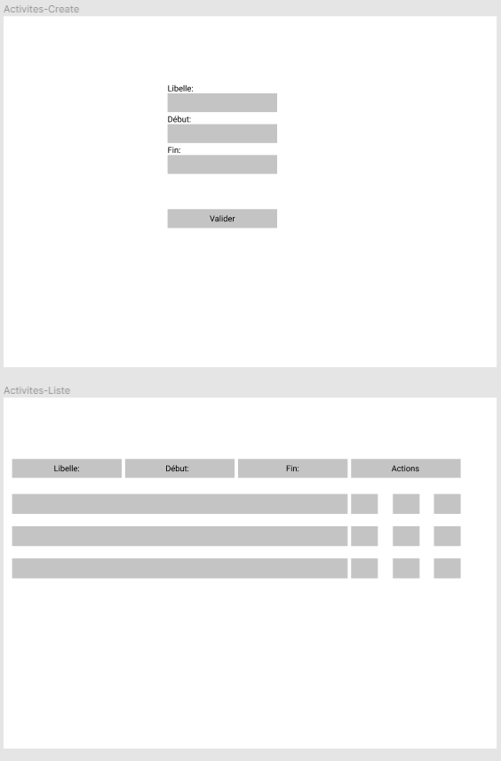

# Resume

Le client souhaite disposer d'une application qui lui permet de saisir en avance un planning sur une journée.
Il veut pouvoir administrer les activités de la journée. Il indique également que ces activités peuvent changer. 
L'application sera à l'usage de personnes qui disposent de plannings communs ou différents selon les cas.

# Backlog

En tant que|Je veux|Afin de|Taches|Priorite
:---|:---|:---|:---|:---
✔Utilisateur|Créer, modifier, desactiver une activité|Gérer les activités possibles|Modele de la table Activite
||||CRUD sur la table
||||Sécuriser le formulaire
✔Utilisateur|Créer, modifier, desactiver un utilisateur|Gérer les utilsateurs|Modele de la table utilisateur
||||CRUD sur la table
||||Sécuriser le formulaire
✔Utilisateur|Affecter une activité à une personne|Visualiser les activités sur une date|Fonction d'ajout de l'id de l'activité à une heure et date

# TASKS

- [ ] Créer la table utilisateur et sa vue d'administration
- [ ] Créer la table role et sa vue d'administration
- [ ] Créer la table activites et sa vue d'administration
- [ ] Créer la table promotion et sa vue d'administration
- [ ] Créer la table d'association user_activity et sa vue d'administration
- [ ] Créer le dossier VUE JS pour l'affichage du planning
- [ ] Générer un code pour accéder au planning de la personne connectée
- [ ] Générer un QR code pour la tache précédente
- [ ] Générer une documentation pour l'utilisation de l'application

# MCD

# MPD

roles: id, libelle;
utilisateurs: id, nom, prenom, #role_id;
posseder: id, #id_utilisateur, #id_activites, libelle, jour;
activites: id, libelle, debut, fin, etat;

# Wireframes

## Roles

## Utilisateurs

## Activites

## Affectations

